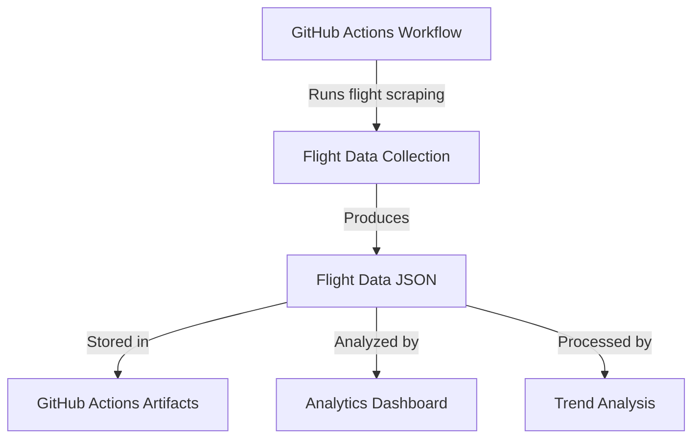

# Flight Data Analytics System

This document describes the flight data collection and analytics system implemented in this project.

## System Overview

The system consists of several components working together to collect, store, and analyze flight price data:



## Components

### 1. Data Collection

- **Process**: GitHub Actions workflow runs flight searches for multiple routes and dates
- **Storage**: Flight data is saved in JSON format with the following structure:
  ```typescript
  interface FlightData {
    route: {
      from: string;
      to: string;
    };
    price: number;
    departureDay: string;
    daysUntilDeparture: number;
    timestamp: string;
  }
  ```

### 2. Data Processing

- Located in `scripts/store-flight-data.ts`
- Handles deduplication of similar entries within 24 hours
- Updates statistics for:
  - Day of week analysis
  - Days until departure analysis
  - Route-specific trends

### 3. Analytics Dashboard

- Available at `http://localhost:3000` when running `npm run dashboard`
- Features:
  - Real-time price trends by route
  - Day of week price analysis
  - Days until departure price patterns
  - Key statistics overview

## Data Persistence

Data is persisted through GitHub Actions in two ways:
1. **Cache**: For quick access between workflow runs
2. **Artifacts**: For long-term storage (90 days retention)

## Usage

### Starting the Dashboard

```bash
npm run dashboard
```

### Analyzing Trends

```bash
npm run analyze
```

### Processing New Data

```bash
npm run data:process
```

## Data Analysis Features

### 1. Price Trends

- Track price changes over time for each route
- Identify seasonal patterns
- Monitor price volatility

### 2. Day of Week Analysis

- Average prices by day of week
- Flight frequency patterns
- Best days to book/travel

### 3. Advance Booking Analysis

- Price trends based on booking lead time
- Optimal booking windows
- Price volatility patterns

## Future Improvements

1. Machine Learning Integration
   - Implement price prediction models
   - Pattern recognition for best booking times
   - Anomaly detection for unusual price changes

2. Enhanced Analytics
   - Route correlation analysis
   - Seasonal trend detection
   - Price spike predictions

3. Data Export
   - CSV export functionality
   - API endpoints for data access
   - Integration with external analysis tools
