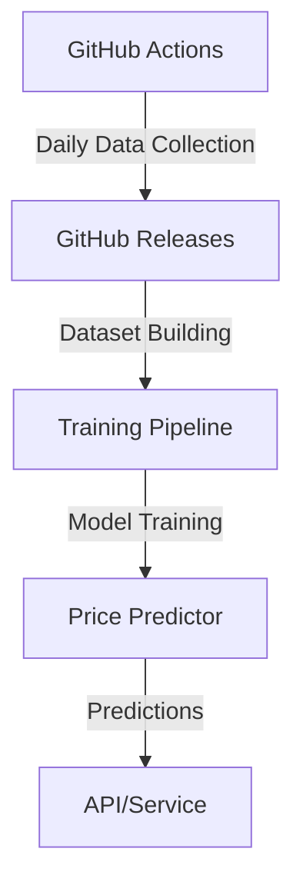

# Flight Price Prediction System Architecture

## Overview

This document outlines the architecture and approach for collecting flight price data and building a prediction model. The system leverages existing GitHub Actions workflows that scrape flight prices to build a dataset for training a machine learning model to predict flight prices based on routes and booking windows.



## Core Components

### 1. Data Collection Pipeline

The system builds upon our existing GitHub Actions workflow that scrapes flight prices from Google Flights. Each run of the workflow collects price data for various routes and dates.

**Data Structure:**
```typescript
interface FlightData {
  route: {
    from: string;    // Origin airport code
    to: string;      // Destination airport code
  };
  price: number;     // Flight price in USD
  searchDate: string;    // When the search was performed
  departureDate: string; // Flight departure date
  daysUntilDeparture: number; // Calculated from search and departure dates
}
```

### 2. Data Storage Strategy

Flight data is stored using GitHub Releases, providing a simple but effective storage solution without additional infrastructure.

**Daily Data File Format:**
```json
{
  "date": "2025-03-25",
  "flights": [
    {
      "route": {
        "from": "ICN",
        "to": "NRT"
      },
      "price": 350.00,
      "searchDate": "2025-03-25",
      "departureDate": "2025-04-15",
      "daysUntilDeparture": 21
    }
    // ... more flight entries
  ],
  "metadata": {
    "totalRoutes": 20,
    "successRate": 0.95
  }
}
```

**Storage Organization:**
- Each day's data is stored in a separate release
- Releases are tagged with format: `data-YYYY-MM-DD`
- Retention policy: 90 days of detailed data

### 3. Feature Engineering

The model uses a minimal set of features focused on the strongest price indicators:

```typescript
interface PredictionFeatures {
  // Core features
  route: string;           // Combined origin-destination (e.g., "ICN-NRT")
  daysUntilDeparture: number; // How far in advance the flight is booked
  historicalAvgPrice: number; // Average price for this route
}
```

**Feature Importance:**
1. Days Until Departure
   - Primary factor in price variations
   - Captures booking window effects
   - Usually shows non-linear relationship with price

2. Route
   - Represents base price level
   - Captures route-specific patterns
   - Encoded as categorical variable

3. Historical Average Price
   - Provides price stability
   - Helps normalize route-specific variations
   - Rolling 30-day average

### 4. Model Architecture

The system uses a simple but effective Gradient Boosting model:

```typescript
class FlightPricePredictor {
  private model: GradientBoostingRegressor;

  constructor() {
    this.model = new GradientBoostingRegressor({
      n_estimators: 100,
      max_depth: 4,
      learning_rate: 0.1
    });
  }

  async train(data: FlightData[]): Promise<void> {
    const features = this.prepareFeatures(data);
    await this.model.train(features);
  }

  async predict(input: PredictionInput): Promise<number> {
    const features = this.prepareFeatures(input);
    return this.model.predict(features);
  }
}
```

### 5. Training Pipeline

The training process runs daily after new data collection:

1. **Data Loading**
   - Fetch last 30 days of data from GitHub Releases
   - Clean and validate data
   - Create training dataset

2. **Feature Preparation**
   - Calculate days until departure
   - Encode routes
   - Compute historical averages

3. **Model Training**
   - Train on prepared dataset
   - Validate on most recent data
   - Save model if performance improves

### 6. Evaluation Metrics

The system uses three key metrics to evaluate model performance:

1. **RMSE (Root Mean Square Error)**
   - Primary metric for model selection
   - Penalizes large prediction errors
   - Measured in same units as prices

2. **MAPE (Mean Absolute Percentage Error)**
   - Provides relative error measure
   - Easier to interpret for business users
   - Goal: MAPE < 15%

3. **R² Score**
   - Indicates prediction quality
   - Ranges from 0 to 1
   - Target: R² > 0.8

## Implementation Plan

### Phase 1: Data Collection
1. Modify GitHub Actions workflow to store data in releases
2. Implement data validation and cleaning
3. Setup retention policy for old data

### Phase 2: Model Development
1. Create feature engineering pipeline
2. Implement basic model training
3. Build evaluation system

### Phase 3: Production System
1. Create prediction API/service
2. Implement automated retraining
3. Setup monitoring and alerts

## Usage Examples

```typescript
// Predicting a flight price
const predictor = new FlightPricePredictor();

const prediction = await predictor.predict({
  from: "ICN",
  to: "NRT",
  departureDate: "2025-05-15"
});

// Result: Predicted price in USD
console.log(`Predicted Price: $${prediction}`);
```

## Best Practices

1. **Data Collection**
   - Collect data at consistent times
   - Validate data before storage
   - Keep raw data alongside processed data

2. **Model Training**
   - Retrain daily with new data
   - Use cross-validation for stability
   - Monitor for performance degradation

3. **Deployment**
   - Version control all components
   - Log predictions and outcomes
   - Regular performance reviews

## Future Improvements

1. **Enhanced Features**
   - Add seasonality indicators
   - Include day-of-week effects
   - Consider airline competition

2. **Model Enhancements**
   - Experiment with ensemble methods
   - Add confidence intervals
   - Implement online learning

3. **System Improvements**
   - Add data quality monitoring
   - Implement automatic outlier detection
   - Create performance dashboards
